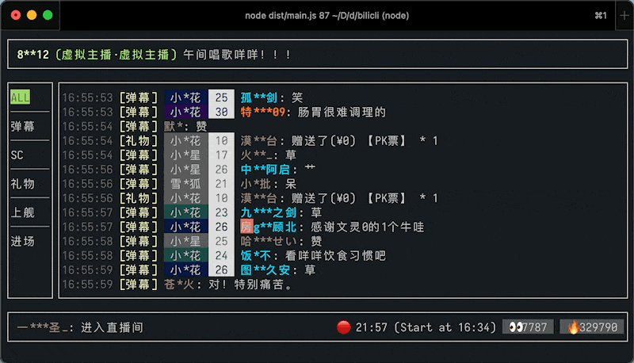

# Bilicli

[](https://www.npmjs.com/package/bilicli)

> 终端里的 Bilibili 弹幕仪表盘



Api driven by [blive-message-listener](https://github.com/ddiu8081/blive-message-listener).

## Usage

```bash
npx bilicli live <room_id> [...options]
npx bilicli live-full <room_id> [...options]
```

### Arguments

- `room_id`: B站直播间房间号，支持短id

### Options

- `-h, --help`: 显示帮助信息
- `--no-badge`: 隐藏用户牌子信息
- `--no-rank`: 隐藏用户榜单排名信息

## Features

- [x] 舰长与房管标识
- [x] 分类查看
- [ ] 数据统计
- [ ] 本地记录保存
- [ ] 筛选面板
- [ ] 发送弹幕

## Streams

- [【直播录像】写一个命令行版弹幕姬 [#1] - 2022.08.26 21:30场](https://www.bilibili.com/video/BV1ze4y1Z7Tu/)
- [【直播录像】写一个命令行版弹幕姬 [#2] - 2022.09.03 20:00场](https://www.bilibili.com/video/BV1mK411Z7d9)
- [【直播录像】写一个命令行版弹幕姬 [#3] - 2022.09.11 20:00场](https://www.bilibili.com/video/BV1nG4y1z7LC)
- [【直播录像】写一个命令行版弹幕姬 [#4] - 2022.09.24 20:00场](https://www.bilibili.com/video/BV1Me4y1r72K)

## Credits

- [temir](https://github.com/webfansplz/temir)

## License

MIT
